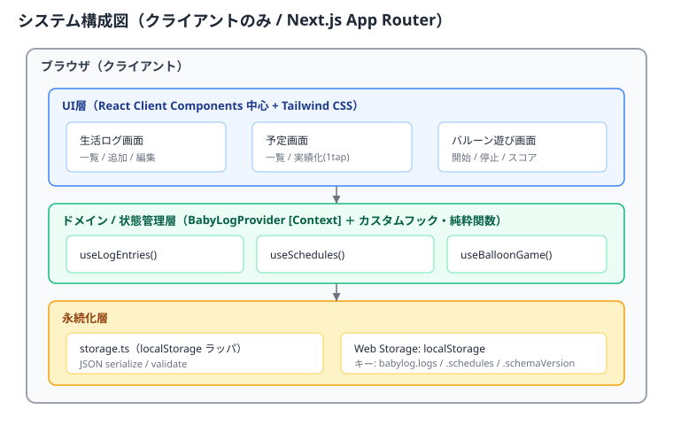
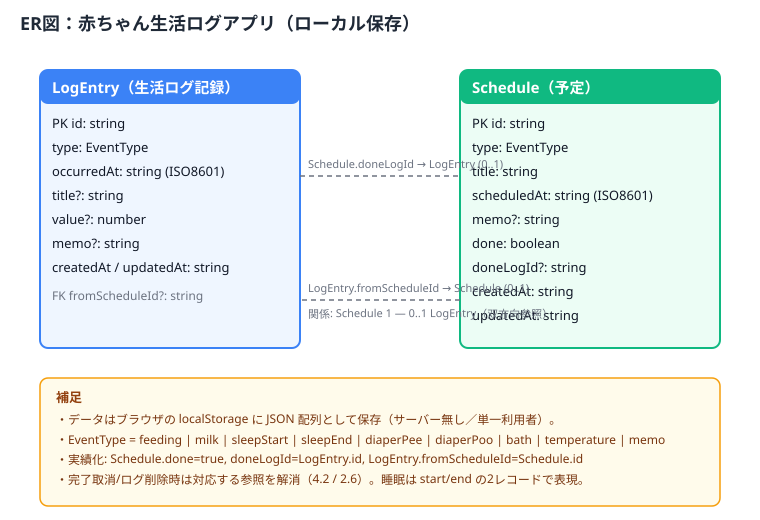
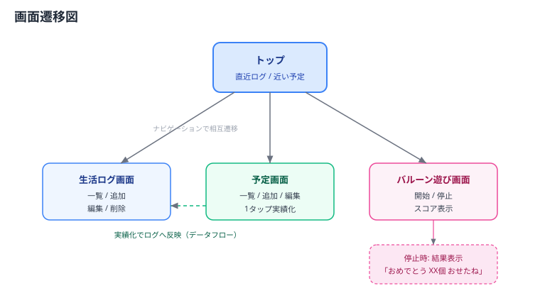

# 機能設計書（Functional Design）

## 0. ドキュメント情報

- 対象：赤ちゃんの生活ログアプリ（ベース機能）
- 位置づけ：`docs/product-requirements.md` で定義した要求を、実装可能な設計に落とし込む。
- 技術スタック：Next.js (App Router) / TypeScript / Tailwind CSS / npm（詳細は `docs/architecture.md`）。

### 改訂履歴
| 版 | 日付 | 変更概要 |
| --- | --- | --- |
| 1.0 | 2026-09-15 | 初版作成。3機能の設計・データモデル・画面遷移を定義 |
| 1.1 | 2026-09-15 | セルフレビュー反映（SSR/ハイドレーション注意、日時TZ、実績化取消の整合、バルーン競合防止、空状態、A11y配慮、schemaVersion） |
| 1.2 | 2026-09-15 | 独立レビュー反映（Context単一状態源・タブ間同期、睡眠ペアリング/体温value、参照整合2.6、日付グルーピングTZ、時刻ベースカウントダウン、確認モーダル、バリデーション確定値、破損時非上書き、クイック記録、A11yコントラスト/aria-live、SVG整合） |

> 用語について：本書の「実績化 / ワンタップ実績化」は、予定（Schedule）を生活ログ（LogEntry）へ変換する操作を指す。
> 「完了 / done」は実績化済みの予定状態を指す。これらの正式定義は `docs/glossary.md` に集約する。

## 1. 全体アーキテクチャ

本アプリはサーバーを持たない**クライアントのみ**の構成とし、データはブラウザの
`localStorage` に保存する。UI層・状態管理層（カスタムフック）・永続化層に分離する。

### レイヤーの役割
| レイヤー | 役割 | 主な構成 |
| --- | --- | --- |
| UI層 | 画面表示・ユーザー操作。Client Component 中心 | 各画面・共通コンポーネント（Tailwind CSS） |
| 状態管理層 | ドメインロジック・状態保持（アプリ全体で単一の状態源） | `BabyLogProvider`（Context）＋ `useLogEntries` / `useSchedules` / `useBalloonGame` |
| 永続化層 | localStorage への読み書き・バリデーション | `storage.ts`（型安全なラッパ） |

### 状態共有の方式（重要）
生活ログと予定は複数画面（トップ・生活ログ・予定）から参照・更新され、かつ「予定→実績のワンタップ」で
両データを同時更新する。フックを画面ごとに独立で持つと状態が同期せず不整合を招くため、以下とする。

- アプリ全体を単一の `BabyLogProvider`（React Context）で包み、`logs` と `schedules` を**単一の状態源**として保持する。
- `useLogEntries()` / `useSchedules()` はこの Context を購読するフックとして実装し、どの画面からでも同じ状態・同じ更新関数を参照する。
- 実績化（`completeAsLog`）のように logs と schedules を同時更新する操作は、Context 内の**1アクションとしてまとめて更新→保存**する（後述 4.2）。
- 状態を更新したら **React state を更新してから** `storage.ts` 経由で localStorage に保存する（localStorage 直書きと state の乖離を作らない）。
- 別タブでの更新に追従するため、`window` の `storage` イベントを購読し、変更時に Context の状態を再読込する。

### 設計方針
- ブラウザのみで動作する**単一の Next.js アプリ**として提供する。画面はルート（マルチページ）で分けるが、共通レイアウト・ナビゲーションで1つのアプリとしてまとまる。
- 記録・予定データを扱う画面は Client Component とし、初回マウント時に localStorage から読み込む。
- localStorage アクセスは `storage.ts` に集約する。JSON パース失敗・スキーマ不一致時は空データとして扱いつつ、**その状態を自動で上書き保存しない**（破損データを黙って全消去しない。詳細は 5 章）。
- 純粋なドメインロジック（並べ替え・実績化変換など）は副作用のない関数として切り出し、テスト容易にする。

### SSR / ハイドレーション上の注意
- `localStorage` はブラウザ専用のため、読み込みは `useEffect`（マウント後）で行う。サーバーレンダリング時とクライアント初期状態を一致させ、ハイドレーション不整合を避ける（初期値は空配列、読み込み完了までローディング/空状態を表示）。
- 現在時刻に依存する初期値（フォームの既定日時など）もマウント後に設定する。

## 2. データモデル

### 2.1 EventType（イベント種別）
生活ログと予定で共通のイベント種別を用いる。

| 値 | 表示名 | 備考 |
| --- | --- | --- |
| `feeding` | 授乳（母乳） | |
| `milk` | ミルク | |
| `sleepStart` | 睡眠開始 | |
| `sleepEnd` | 睡眠終了 | |
| `diaperPee` | おむつ（おしっこ） | |
| `diaperPoo` | おむつ（うんち） | |
| `bath` | お風呂 | |
| `temperature` | 体温 | `value` に測定値（数値）を格納 |
| `memo` | メモ | 自由記述 |

### 2.2 LogEntry（生活ログ記録）
| フィールド | 型 | 必須 | 説明 |
| --- | --- | --- | --- |
| `id` | string | ✓ | 一意なID（`crypto.randomUUID()`） |
| `type` | EventType | ✓ | イベント種別 |
| `occurredAt` | string (ISO8601) | ✓ | 実施日時 |
| `title` | string | | 内容の要約（実績化時に予定の `title` を引き継ぐ。手動記録では任意） |
| `value` | number | | 数値（体温など、種別が数値を伴う場合に使用） |
| `memo` | string | | 任意メモ |
| `fromScheduleId` | string | | 予定から実績化した場合の元予定ID |
| `createdAt` | string (ISO8601) | ✓ | 作成日時 |
| `updatedAt` | string (ISO8601) | ✓ | 更新日時 |

> **睡眠の扱い（ベース）**：睡眠は `sleepStart` と `sleepEnd` の2レコードで記録する。睡眠時間の算出は、
> 表示側で「同日内の直近の未対応 `sleepStart` と `sleepEnd` を時系列でペアリング」して求める（区間モデルは将来拡張）。
> ペアが揃わない（開始のみ／終了のみ）場合は時間を算出せず、その旨を表示する。ベース機能では睡眠時間の
> 集計表示は必須とせず、記録・一覧が主目的とする。
>
> **体温の扱い**：`temperature` は `value`（数値）に測定値を格納し、`memo` は補足に用いる。

### 2.3 Schedule（予定）
| フィールド | 型 | 必須 | 説明 |
| --- | --- | --- | --- |
| `id` | string | ✓ | 一意なID |
| `type` | EventType | ✓ | イベント種別 |
| `title` | string | ✓ | 予定のタイトル／内容 |
| `scheduledAt` | string (ISO8601) | ✓ | 予定日時 |
| `memo` | string | | 任意メモ |
| `done` | boolean | ✓ | 実績化済みかどうか（初期値 false） |
| `doneLogId` | string | | 実績化で生成した LogEntry の ID |
| `createdAt` | string (ISO8601) | ✓ | 作成日時 |
| `updatedAt` | string (ISO8601) | ✓ | 更新日時 |

### 2.4 永続化キー
| キー | 内容 |
| --- | --- |
| `babylog.logs` | LogEntry[] の JSON |
| `babylog.schedules` | Schedule[] の JSON |
| `babylog.schemaVersion` | データ構造のバージョン（将来のマイグレーション用、初期値 1） |

- 読み込み時に `schemaVersion` が既知の現行値と一致すればそのまま利用。将来、より新しい未知バージョンを検出した場合は破損時と同様に上書きせず読み込みを見送る。過去バージョンからの移行が必要になった時点でマイグレーション処理を追加する。

### 2.5 日時の扱い
- 保存はすべて ISO8601 文字列（`new Date().toISOString()`、UTC基準）。
- 画面の日時入力は `<input type="datetime-local">` を用い、ローカル時刻 ⇔ ISO8601 の相互変換を `storage.ts` 近傍のユーティリティに集約する。
- 表示はローカルタイムゾーンで整形（`toLocaleString` 等）する。
- **日付グルーピングはローカルタイムゾーンの暦日**を基準とする（保存はUTCだが、見出しの日付は端末ローカル日付で判定）。

### 2.6 参照整合性の維持
`Schedule.doneLogId`（→LogEntry）と `LogEntry.fromScheduleId`（→Schedule）は双方向参照になる。整合のため以下を守る。

- 実績化した LogEntry を生活ログ画面から削除した場合、`fromScheduleId` を辿って対応する Schedule を `done=false`／`doneLogId` クリアに戻す（ダングリング参照を残さない）。
- 予定の完了取り消し（`uncomplete`）では、`doneLogId` の LogEntry を削除してから参照をクリアする（4.2 参照）。
- 表示側でも、参照先が見つからない場合に落ちないよう防御的に扱う。

## 3. 画面設計

### 3.1 画面遷移

全画面共通で下部（またはヘッダ）にナビゲーションを置き、トップ／生活ログ／予定／バルーン遊びへ相互に遷移できる。

### 3.2 画面一覧
| 画面 | パス（想定） | 概要 |
| --- | --- | --- |
| トップ | `/` | 直近のログと近い予定のサマリ、各画面への導線 |
| 生活ログ | `/logs` | ログの一覧・追加・編集・削除 |
| 予定 | `/schedules` | 予定の一覧・追加・編集・削除・1タップ実績化 |
| バルーン遊び | `/play` | バルーン遊びの開始・停止・スコア表示 |

### 3.3 各画面の要素

#### トップ（`/`）
- 直近の生活ログ（最新5件程度）を新しい順に表示。
- 近い予定：**未完了**の予定を `scheduledAt` 昇順（過去の遅れ分を含む）で数件表示する。予定日時が現在より過去のものは「遅れ」が分かる表示にする。
- 各機能画面へのナビゲーション。
- データが0件の場合は、記録・予定の追加を促す空状態メッセージを表示。

#### 生活ログ（`/logs`）
- **クイック記録**：よく使う種別（授乳・ミルク・おむつ等）のボタンを並べ、タップすると現在時刻で即記録できる（PRDの「3タップ以内」を担保）。詳細を足したい場合は記録後に編集する。
- 記録追加フォーム：種別（選択）／日時（既定は現在時刻）／メモ（任意）。数値を伴う種別（体温）では数値入力欄を表示。
- 一覧：日時の新しい順。日付ごとの見出しでグルーピング。
- 各項目に編集・削除操作（削除は確認を挟む）。
- 0件時は空状態メッセージを表示。

#### 予定（`/schedules`）
- 予定追加フォーム：種別／タイトル／日時／メモ。
- 一覧：まず未完了を `scheduledAt` 昇順、続けて完了を後方に（完了は `scheduledAt` 降順）表示し、未完了/完了をスタイルで区別。
- 各未完了予定に「実績にする」ボタン（**ワンタップ実績化**）。
- 完了予定は「完了を取り消す」で未完了に戻せる。
- 各項目に編集・削除操作（削除は確認を挟む）。
- 0件時は空状態メッセージを表示。

#### バルーン遊び（`/play`）
- 「開始」ボタンで遊びを開始。開始後はランダム位置にバルーンを1つ表示。
- スコア（押せた個数）を常時表示。
- 「停止（Stop）」ボタンで終了し、結果メッセージを表示。
- プレイ中に他画面へ遷移した場合はゲームを終了する（4.3 参照。スコアは保持しない）。

#### 確認ダイアログ（共通）
- 削除・完了取り消しなどの破壊的操作は、デザイン統一とアクセシビリティのため、ブラウザ標準 `confirm()` ではなく**アプリ内モーダル**（フォーカストラップ・Esc/ボタンで閉じる・`role="dialog"`）で確認する。

## 4. 機能別ロジック設計

### 4.1 生活ログ記録（useLogEntries）
- `entries: LogEntry[]` を保持し、初回マウントで localStorage から読み込む。
- `add(input)`：ID・タイムスタンプを付与して追加し、保存。
- `update(id, patch)`：該当エントリを更新し `updatedAt` を更新、保存。
- `remove(id)`：削除して保存。
- 一覧取得：`occurredAt` の降順にソートして返す（純粋関数 `sortByOccurredAtDesc`）。

### 4.2 予定管理（useSchedules）
- `schedules: Schedule[]` を保持し、初回マウントで読み込む。
- `add / update / remove`：ログ同様の CRUD。
- 一覧取得：未完了を `scheduledAt` 昇順、完了を後方に配置。
- **completeAsLog(scheduleId)（ワンタップ実績化）**：logs と schedules を **Context 内の単一アクションとしてまとめて更新**する（途中失敗で片方だけ更新されないようにする）。
  1. 対象 Schedule を取得。
  2. `LogEntry` を生成する。
     - `type` = 予定の `type`
     - `occurredAt` = タップ時刻（現在時刻）
     - `title` = 予定の `title`（そのまま引き継ぐ）
     - `memo` = 予定の `memo`（あればそのまま。無ければ未設定）
     - `fromScheduleId` = 予定の `id`
  3. logs に追加。
  4. Schedule を `done=true`、`doneLogId=生成したLogEntry.id` に更新。
  5. 更新後の logs・schedules を保存（1回のまとめ更新）。
- **uncomplete(scheduleId)**：`done=false` に戻す。データの整合を保つため、`doneLogId` が指す LogEntry を**削除**してから `doneLogId` をクリアする（残すと再実績化でログが重複するため）。
  - 誤操作・データ損失対策として、取り消し時は確認を挟む。特に**対応ログが実績化後に編集されている場合**（`updatedAt` が生成時より後）は、その旨を明示して確認する。
- 実績化は同一予定に対して二重に行われないよう、`done=true` の予定には「実績にする」ボタンを表示しない。

### 4.3 バルーン遊び（useBalloonGame）
状態機械で管理する。

| 状態 | 説明 | 主な遷移 |
| --- | --- | --- |
| `idle` | 未開始（「開始」ボタン表示） | 開始 → `playing` |
| `playing` | プレイ中（バルーン表示・カウントダウン進行） | 停止 → `stopped` ／ 画面離脱 → 終了 |
| `stopped` | 停止後（結果メッセージ・「もう一度」ボタン表示） | もう一度（開始）→ `playing` |

- **開始**（`idle`／`stopped` → `playing`）：`state=playing`、`score=0`、最初のバルーンを生成。
- **バルーン生成 `spawnBalloon()`**（順序に注意）：
  1. サイズを確定：初期は大きめ（例：直径 96〜120px 相当、画面幅に応じて調整）。
  2. サイズを踏まえて位置を確定：プレイ領域からバルーン直径ぶんを差し引いた範囲でランダム座標を選び、画面外にはみ出さないようにする。
  3. 色：定義済みパレットからランダム選択。
  4. カウント初期値：3〜5 のランダム整数。
  5. バルーンに一意IDを付与。
- **カウントダウン**：約1秒ごとに残り秒を再計算し表示する。0 になったら **自動破裂** → `spawnBalloon()`（スコア加算なし）。
  - 実装は **時刻ベース**（生成時に `expireAt` を持ち、`残り = ceil((expireAt - now)/1000)` で算出）とし、`setInterval` のドリフトや非アクティブタブでのスロットリングの影響を受けにくくする。
  - タイマー／最新スコアは `useRef` で保持し、stale closure（古い state を掴む）を避ける。
- **タップ**：現在のバルーンをタップすると破裂エフェクト → `score += 1` → `spawnBalloon()`。
- **競合防止**：破裂処理（タップ／自動）は「現在表示中のバルーンIDと一致する場合のみ」実行する。カウントダウン到達とタップがほぼ同時でも、二重に次のバルーンを生成しない。
- **停止（Stop）**：`state=stopped`、タイマー停止。結果メッセージ `おめでとう {score}個 おせたね` を表示。
- **再開**：`stopped` から「開始」で `score` を 0 にリセットして再度 `playing`。
- タイマーは状態遷移・アンマウント時に必ず解除してリークを防ぐ。**プレイ中に他画面へ遷移するとコンポーネントがアンマウントされ、ゲームは自動終了する**（スコアは保持しない）。
- ゲーム状態は永続化しない（セッション内のみ）。

#### 色パレット（ベース）
やわらかいパステル系を基本とする（具体値は `development-guidelines.md` / 実装時に確定）。
例：ピンク・スカイブルー・イエロー・グリーン・パープル・オレンジ。

## 5. バリデーション・エラー処理

| 対象 | ルール |
| --- | --- |
| ログの種別 | EventType のいずれか必須 |
| ログの日時 | 必須。パース可能な日時であること。未来日時も許容する（後追い・訂正のため） |
| ログの数値（体温等） | `temperature` の場合は数値必須。妥当な範囲（例：30〜45℃）でバリデーション |
| 予定のタイトル | 必須。空文字不可。前後空白はトリム。最大100文字 |
| 予定の日時 | 必須。パース可能な日時であること。過去日時も許容する（遅れの記録のため） |
| メモ | 任意。最大500文字 |
| 日時の空値／不正値 | フォーム側でエラー表示し、保存させない |
| localStorage 読み込み | JSON パース失敗・スキーマ不一致時は、その場で**上書きせず**空データとして扱い、ユーザーにデータ読み込み不可の旨を通知する（黙って全消去して上書きしない） |
| localStorage 保存 | `QuotaExceededError` 等の保存失敗時はユーザーに通知し、直近の操作を取り消す（状態と保存内容を乖離させない） |

## 6. セキュリティ設計

- ユーザー入力（メモ・タイトル）は React の標準エスケープにより描画し、`dangerouslySetInnerHTML` は使用しない（XSS対策）。
- 入力バリデーションを追加・編集時に実施する。
- 外部送信を行わないため、個人データはネットワークに出ない。

## 6.5 アクセシビリティ・演出配慮

- バルーン遊びは激しい点滅を避け、破裂は穏やかなアニメーションにする。
- `prefers-reduced-motion` が有効な環境では、アニメーションを簡略化・低減する。
- ボタン・タップ対象は十分な大きさを確保し、色のみに依存しない情報提示（アイコン・ラベル併用）を行う。
- 文字サイズ・コントラストに配慮する。バルーンの色はランダムだが、**各パレット色に対して数字が読めるコントラストを確保**する（色ごとに数字色を明/暗から選ぶ等）。
- スコアの増減や停止時の結果メッセージは、スクリーンリーダーに伝わるよう `aria-live` 領域で通知する。

## 7. 今後の拡張余地（本フェーズ対象外）

- 記録の統計・グラフ表示
- データのエクスポート／インポート（バックアップ）
- 予定のリマインド通知
